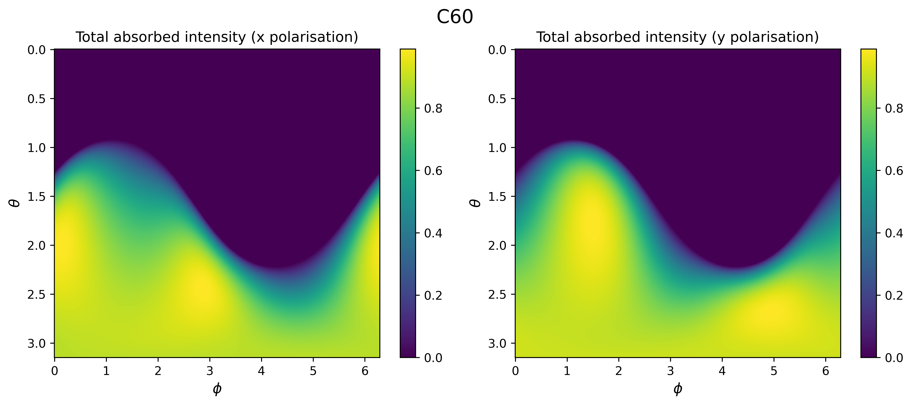

# Polarisation Dependence of Photophoretic Force

Codes required in the air trap using photophoresis work in LML

This repository contains python codes used to analyse polarization-dependent absorption of carbon microsphere clusters, assumed to be ellipsoids.

## Repository Structure

Codes for Analysis/      → Jupyter Notebooks for the analysis  
Results/                 → Example outputs  
Example data/            → A small dataset for testing

## Example Output

